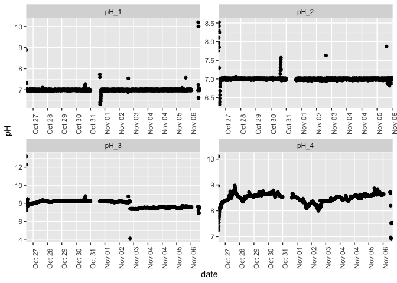
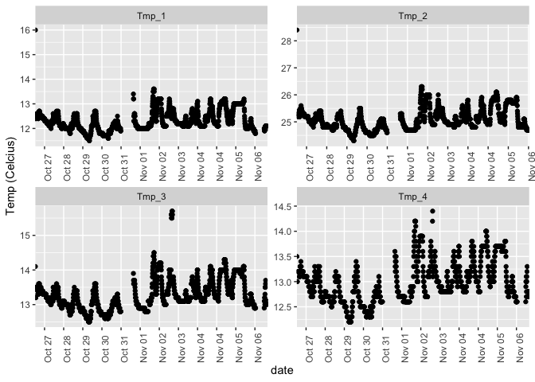

Apex Water Chem Oct-Nov 2018
================
Shelly Trigg
11/9/2018

``` r
#load libraries
library("XML")  
library("plyr")

#download Apex data; so far I can only download data from being on site using this code
date <- 181026 #start date of data to download in yymmdd format   
numdays <- 14 #number of days of of data to download  
#read in the date plus numdays of Apex data
xmlfile <- xmlParse(paste("http://192.168.1.101:80/cgi-bin/datalog.xml?sdate=",date,"&days=",numdays)) 

#convert xml to dataframe
Apex.Data <- ldply(xmlToList(xmlfile), data.frame) 

#save data as csv file
write.csv(Apex.Data, "~/Documents/GitHub/P_generosa/Water_Chemistry/Apex_data_20181026-20181107.csv", quote =FALSE, row.names = FALSE)
```

``` r
library(tidyr)
```

    ## Warning: package 'tidyr' was built under R version 3.4.4

``` r
Apex.Data <- read.csv("~/Documents/GitHub/P_generosa/Water_Chemistry/Apex_data_20181026-20181107.csv", stringsAsFactors = FALSE)

#remove uninformative columns
Apex.Data <- Apex.Data[-c(1:3),-c(1:2,grep("type", colnames(Apex.Data)))]

#probe name and data are listed in pairwise columns. The following code reorganizes the table to have 
#one column with the date/time, one column with probe name, and one colum with probe value.
#I did this by splitting the data into two data frames and then recombining them. There is probably a better way to do this.
#make a data frame of just probe names
Apex.Data.probe <- Apex.Data[,c(1,grep("name", colnames(Apex.Data)))]
#reshabe data frame into long format
Apex.Data.probe <- gather(Apex.Data.probe, probe_name, value ,-1)
#make a data frame of just probe values
Apex.Data.val <- Apex.Data[,c(1,grep("value", colnames(Apex.Data)))]
#reshabe data frame into long format
Apex.Data.val <- gather(Apex.Data.val, value2, value ,-1)
#recombine probe and value data frames
Apex.Data <- cbind(Apex.Data.probe[,-2], Apex.Data.val[,3])
#extract only pH and temperature data
Apex.Data <- Apex.Data[grep("pH|Tmp", Apex.Data$value),]
#extract data for only pH and temperature probes 1 through 4
Apex.Data <- Apex.Data[-grep("6", Apex.Data$value),]
#convert date/time from character to POSIX so R will read it as a date
Apex.Data$date <- as.POSIXct(strptime(Apex.Data$date, "%m/%d/%Y %H:%M:%S"))
#simplify column names
colnames(Apex.Data) <- c("date", "probe", "value")
#Probe 'Tmp' was renamed to 'Tmp_1' so rename it in the data to reflect that
Apex.Data$probe <- gsub("^Tmp$", "Tmp_1", Apex.Data$probe)
#Probe 'pH' was renamed to 'pH_1' so rename it in the data to reflect that
Apex.Data$probe <- gsub("^pH$", "pH_1", Apex.Data$probe)
```

Apex pH data from Oct 26 (start day) - Nov 7 2018

    ## Warning: package 'ggplot2' was built under R version 3.4.4



Apex temperature data from Oct 26 (start day) - Nov 7 2018 
