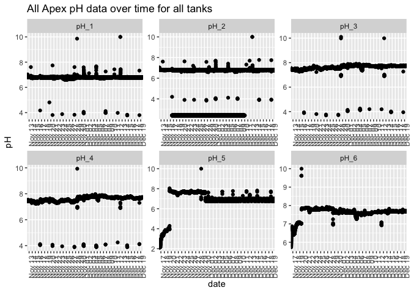
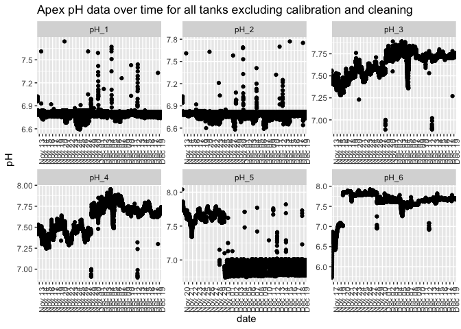
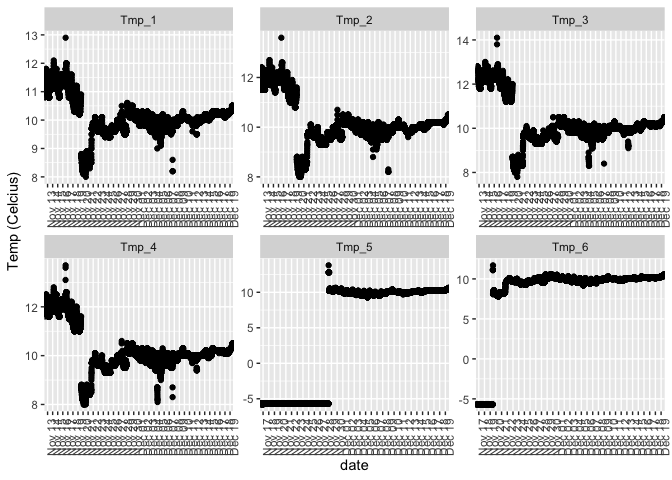

AnalyzeApexData
================
Shelly Trigg
12/14/2018

load libraries

    ## Warning: package 'tidyr' was built under R version 3.4.4

    ## Warning: package 'ggplot2' was built under R version 3.4.4

    ## 
    ## Attaching package: 'rowr'

    ## The following object is masked from 'package:plyr':
    ## 
    ##     count

Read in Apex data

Clean data up

Plotting Apex data 
