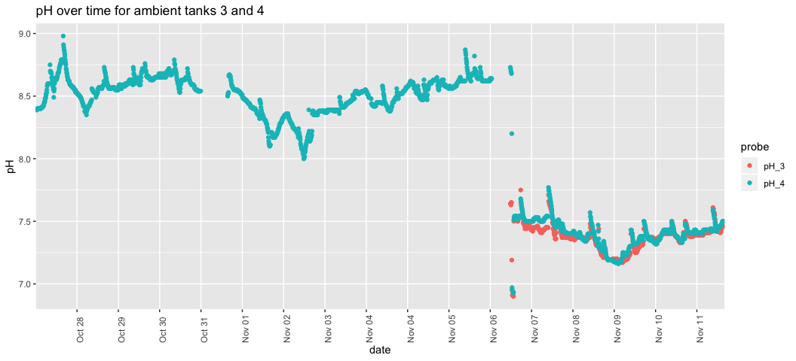
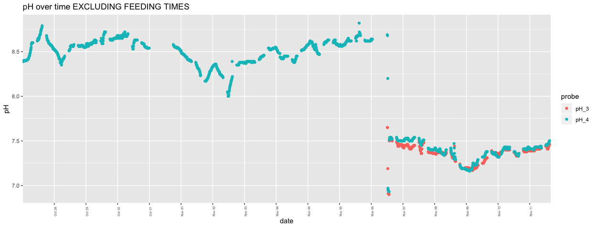
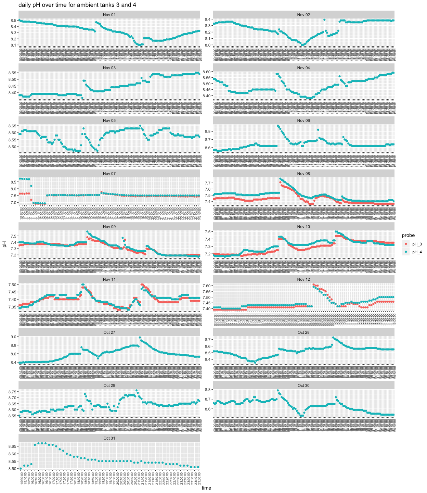
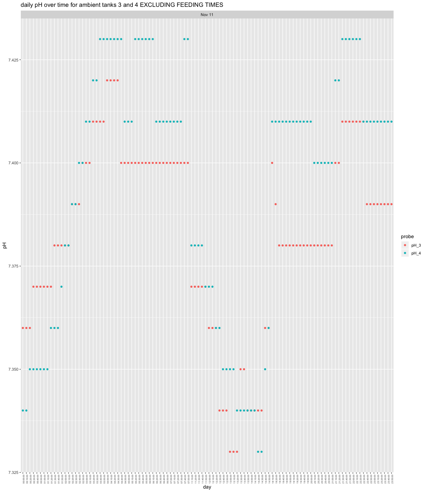
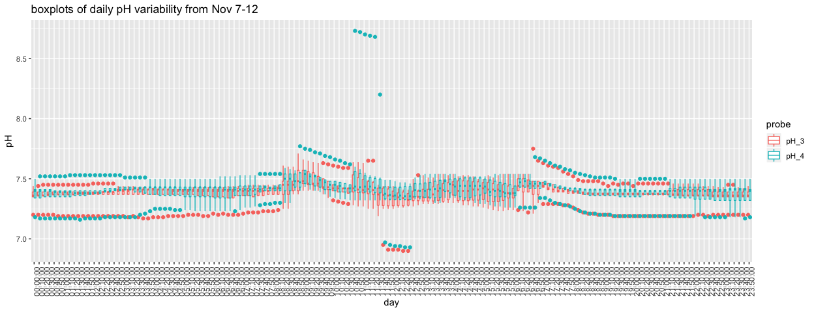
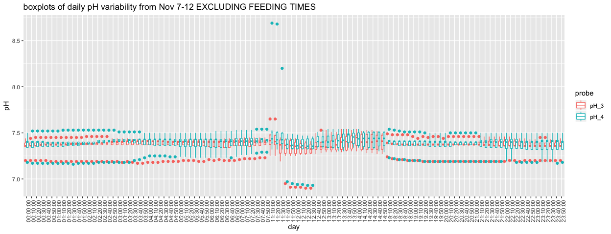

Apex\_Amb\_variation\_Oct-Nov
================
Shelly Trigg
11/21/2018

load libraries

``` r
library("XML")
```

    ## Warning: package 'XML' was built under R version 3.4.4

``` r
library("plyr")
library("tidyr")
```

    ## Warning: package 'tidyr' was built under R version 3.4.4

``` r
library("ggplot2")
```

    ## Warning: package 'ggplot2' was built under R version 3.4.4

``` r
library("dplyr")
```

    ## Warning: package 'dplyr' was built under R version 3.4.4

    ## 
    ## Attaching package: 'dplyr'

    ## The following objects are masked from 'package:plyr':
    ## 
    ##     arrange, count, desc, failwith, id, mutate, rename, summarise,
    ##     summarize

    ## The following objects are masked from 'package:stats':
    ## 
    ##     filter, lag

    ## The following objects are masked from 'package:base':
    ## 
    ##     intersect, setdiff, setequal, union

``` r
library("data.table")
```

    ## Warning: package 'data.table' was built under R version 3.4.4

    ## 
    ## Attaching package: 'data.table'

    ## The following objects are masked from 'package:dplyr':
    ## 
    ##     between, first, last

Read in all available Apex data

``` r
Apex.Data <- read.csv("~/Documents/GitHub/P_generosa/Water_Chemistry/Apex_data_20181026-20181107.csv", stringsAsFactors = FALSE)
Apex.Data2 <- read.csv("~/Documents/GitHub/P_generosa/Water_Chemistry/Apex_data_20181107-20181112.csv", stringsAsFactors = FALSE)
#remove extra data (e.g. extra columns, probes we aren't using)
Apex.Data <- Apex.Data[-c(1:3),-c(1:2,grep("type", colnames(Apex.Data)))]
Apex.Data2 <- Apex.Data2[-c(1:3),-c(1:2,grep("type", colnames(Apex.Data2)))]
#combine data frames to one
Apex.Data <- merge(Apex.Data, Apex.Data2, all = TRUE)
#make a data frame of just probe names
Apex.Data.probe <- Apex.Data[,c(1,grep("name", colnames(Apex.Data)))]
#make a data frame of just probe values
Apex.Data.val <- Apex.Data[,c(1,grep("value", colnames(Apex.Data)))]
#reshabe data frames into long format
Apex.Data.probe <- gather(Apex.Data.probe, probe_name, value ,-1)
Apex.Data.val <- gather(Apex.Data.val, value2, value ,-1)
#recombine probe name and value long data frames
Apex.Data <- cbind(Apex.Data.probe[,-2], Apex.Data.val[,3])
#extract pH, salt, oxygen, and temperature data
Apex.Data <- Apex.Data[grep("pH|Tmp|Salt|ORP", Apex.Data$value),]
#convert date/time from character to POSIX so R will read it as a date
Apex.Data$date <- as.POSIXct(strptime(Apex.Data$date, "%m/%d/%Y %H:%M:%S"))
#rename columns
colnames(Apex.Data) <- c("date", "probe", "value")
#Probe 'Tmpx6' and 'pHx6' were renamed to 'Tmp-2' and 'pH-2' so rename them in the data to reflect that
Apex.Data$probe <- gsub("x6", "_2", Apex.Data$probe)
#replace the hyphen in 'Tmp-2' and 'pH-2' with an underscore
Apex.Data$probe <- gsub("-","_", Apex.Data$probe)
#Probe 'Tmp' was renamed to 'Tmp_1' so rename it in the data to reflect that
Apex.Data$probe <- gsub("^Tmp$", "Tmp_1", Apex.Data$probe)
#Probe 'pH' was renamed to 'pH_1' so rename it in the data to reflect that
Apex.Data$probe <- gsub("^pH$", "pH_1", Apex.Data$probe)
```

Plotting daily pH variability in ambient treatments Feeding typically happens sometime between 8-10am and 4-6pm. The tanks are cleaned (emptied, sprayed, and refilled) on Fridays (Nov. 2 and 9) and possibly some other days. Apex records data every 10 minutes.

### Daily pH variability

 I excluded feeding times to get a better sense of daily pH variability. 





  Overall, it does not seem like there's very consistent variability between days.

Daily ambient pH summary stats

| hour |       avg|         sd|  median|
|:-----|---------:|----------:|-------:|
| 00   |  7.744468|  0.5853346|   7.400|
| 01   |  7.755000|  0.5861922|   7.420|
| 02   |  7.755833|  0.5801864|   7.425|
| 03   |  7.750625|  0.5774832|   7.415|
| 04   |  7.748542|  0.5723003|   7.390|
| 05   |  7.713913|  0.5614999|   7.370|
| 06   |  7.646191|  0.5395072|   7.355|
| 07   |  7.674048|  0.5456482|   7.380|
| 08   |  7.723571|  0.5574630|   7.400|
| 09   |  7.796190|  0.5179036|   7.520|
| 10   |  7.705833|  0.4939327|   7.445|
| 11   |  7.636296|  0.5202224|   7.425|
| 12   |  7.601852|  0.5568275|   7.350|
| 13   |  7.667593|  0.5269060|   7.455|
| 14   |  7.682963|  0.5375087|   7.485|
| 15   |  7.692857|  0.5887345|   7.440|
| 16   |  7.745208|  0.6201750|   7.440|
| 17   |  7.722708|  0.5694370|   7.420|
| 18   |  7.672391|  0.5711166|   7.380|
| 19   |  7.677381|  0.5895267|   7.370|
| 20   |  7.726944|  0.6174918|   7.405|
| 21   |  7.723889|  0.6143441|   7.415|
| 22   |  7.670476|  0.5730873|   7.400|
| 23   |  7.667381|  0.5672830|   7.420|

Daily ambient pH summary stats for time chunks
