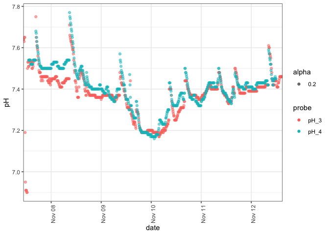
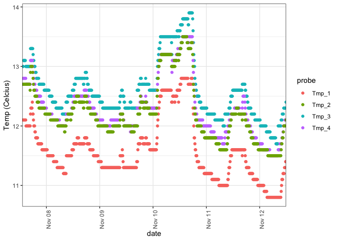
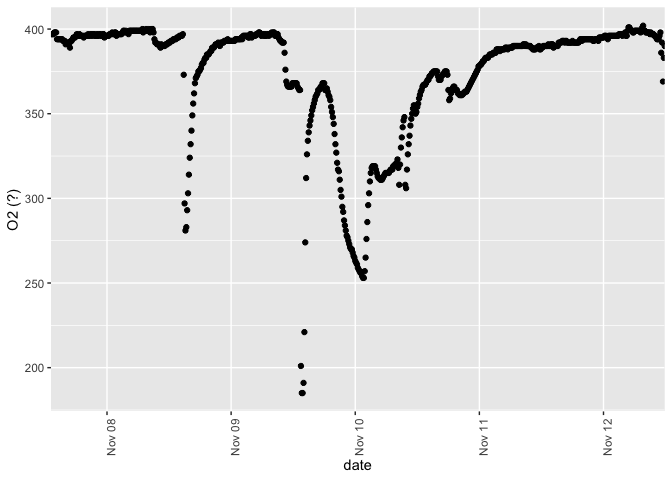
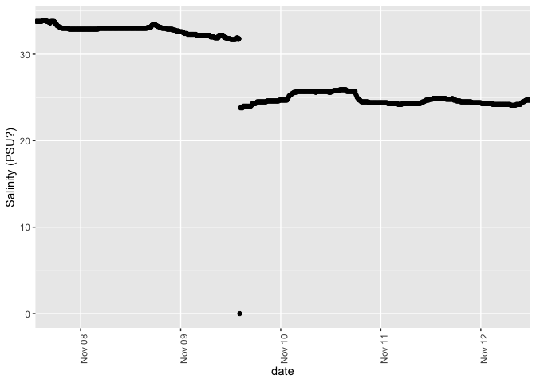

Apex Water Chem Nov 7 to 12
================
Shelly Trigg
11/12/2018

``` r
#load libraries
library("XML")
```

    ## Warning: package 'XML' was built under R version 3.4.4

``` r
library("plyr")
library("tidyr")
```

    ## Warning: package 'tidyr' was built under R version 3.4.4

``` r
library("ggplot2")
```

    ## Warning: package 'ggplot2' was built under R version 3.4.4

``` r
#read in the date plus x days of Apex data
xmlfile <- xmlParse("http://192.168.1.101:80/cgi-bin/datalog.xml?sdate=181107&days=6") 

#convert xml to dataframe
Apex.Data <- ldply(xmlToList(xmlfile), data.frame)

#output the Apex data to a csv file; this is to make a copy of the raw data
write.csv(Apex.Data, "~/Documents/GitHub/P_generosa/Water_Chemistry/Apex_data_20181107-20181112.csv", quote =FALSE, row.names = FALSE)
```

``` r
#read in the csv file
Apex.Data <- read.csv("~/Documents/GitHub/P_generosa/Water_Chemistry/Apex_data_20181107-20181112.csv", stringsAsFactors = FALSE)

#remove uninformative rows and columns
Apex.Data <- Apex.Data[-c(1:3),-c(1:2,grep("type", colnames(Apex.Data)))]
#probe name and data are listed in pairwise columns. The following code reorganizes the table to have 
#one column with the date/time, one column with probe name, and one colum with probe value.
#I did this by splitting the data into two data frames and then recombining them. There is probably a better way to do this.
#make a data frame of just probe names
Apex.Data.probe <- Apex.Data[,c(1,grep("name", colnames(Apex.Data)))]
#make a data frame of just probe values
Apex.Data.val <- Apex.Data[,c(1,grep("value", colnames(Apex.Data)))]
#reshabe data frames into long format
Apex.Data.probe <- gather(Apex.Data.probe, probe_name, value ,-1)
Apex.Data.val <- gather(Apex.Data.val, value2, value ,-1)
#recombine probe and value data frames
Apex.Data <- cbind(Apex.Data.probe[,-2], Apex.Data.val[,3])
#extract only pH and temperature data
Apex.Data <- Apex.Data[grep("pH|Tmp|Salt|ORP", Apex.Data$value),]
#convert date/time from character to POSIX so R will read it as a date
Apex.Data$date <- as.POSIXct(strptime(Apex.Data$date, "%m/%d/%Y %H:%M:%S"))
#simplify column names
colnames(Apex.Data) <- c("date", "probe", "value")
#Probe 'Tmpx6' and 'pHx6' were renamed to 'Tmp-2' and 'pH-2' so rename them in the data to reflect that
Apex.Data$probe <- gsub("x6", "_2", Apex.Data$probe)
#replace the hyphen in 'Tmp-2' and 'pH-2' with an underscore
Apex.Data$probe <- gsub("-","_", Apex.Data$probe)
```

Apex pH probe time series data after re-calibrating all pH probes from Nov 7, 2018 1pm to Nov 12, 2018 12pm. Tanks 1 and 2 were set at pH 7.00, and tanks 3 and 4 are ambient. 

Constant low pH probe data 

Ambient pH probe data 

Boxplots of Apex pH probe data after re-calibrating all pH probes from Nov 7, 2018 1pm to Nov 12, 2018 12pm. Tanks 1 and 2 were set at pH 7.00, and tanks 3 and 4 are ambient. 

Apex temperature probe time series data after re-calibrating all pH probes from Nov 7, 2018 1pm to Nov 12, 2018 12pm. 

Boxplots of Apex temperature probe data after re-calibrating all pH probes from Nov 7, 2018 1pm to Nov 12, 2018 12pm. 


Time series O2 data 

Time series salt data 
