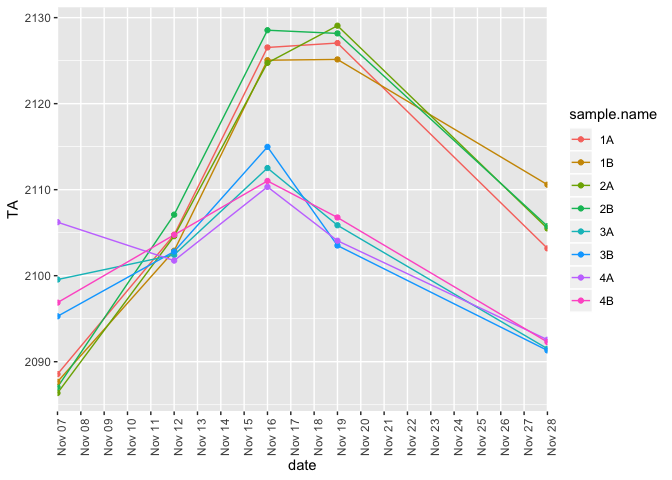
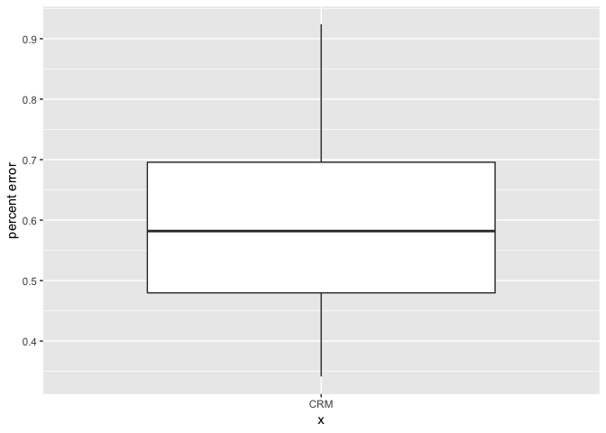
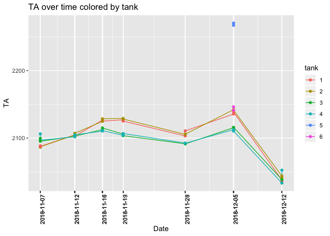
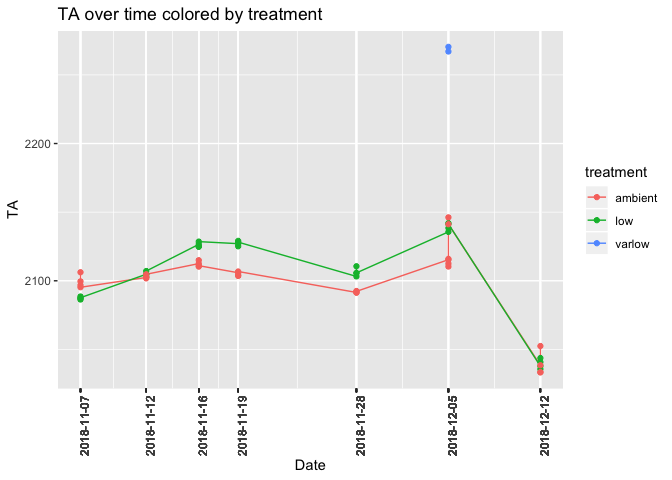
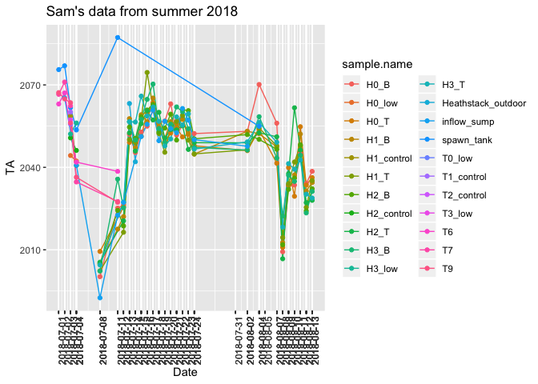
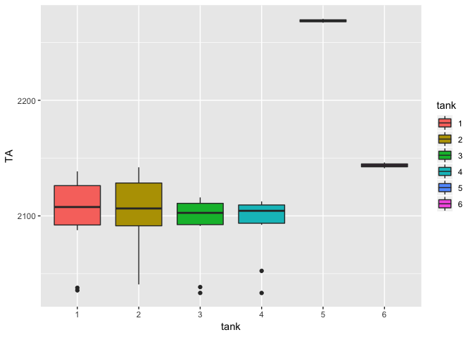
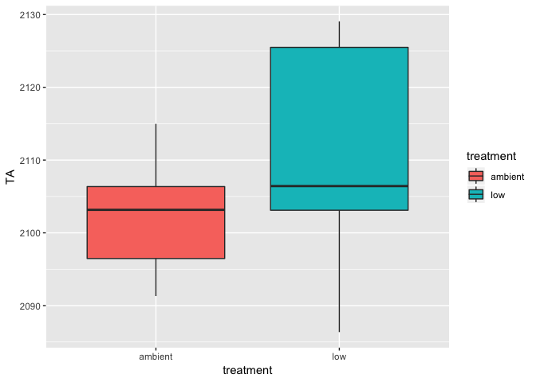
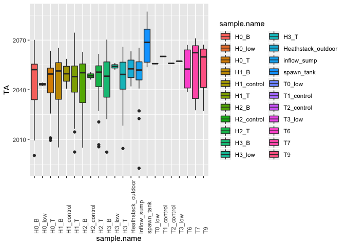

TitratorAnalysis
================
Shelly Trigg
12/18/2018

    ## Warning: package 'ggplot2' was built under R version 3.4.4

CRM percent error 

TA over time for ambient and low treatments 

Boxplots of all TA measurements (Nov 7-Dec 12) for ambient and low **WATER SAMPLES** 

Boxplots of all TA measurements (Nov 7-Dec 12) for ambient and low **TANKS** 

Boxplots of all TA measurements (Nov 7-Dec 12) for ambient and low **TREATMENTS** 

Boxplots of all TA measurements for **Summer 2018** 

    ##             Df Sum Sq Mean Sq F value Pr(>F)
    ## tank         3   1287   429.1   0.518  0.672
    ## Residuals   52  43097   828.8

    ##   Tukey multiple comparisons of means
    ##     95% family-wise confidence level
    ## 
    ## Fit: aov(formula = TA ~ tank, data = fall.data[which(fall.data$tank == "1" | fall.data$tank == "2" | fall.data$tank == "3" | fall.data$tank == "4"), ])
    ## 
    ## $tank
    ##            diff       lwr      upr     p adj
    ## 2-1   1.8399337 -27.03965 30.71952 0.9982584
    ## 3-1  -9.0023922 -37.88198 19.87719 0.8412521
    ## 4-1  -8.1163790 -36.99596 20.76321 0.8779846
    ## 3-2 -10.8423259 -39.72191 18.03726 0.7520814
    ## 4-2  -9.9563127 -38.83590 18.92327 0.7969443
    ## 4-3   0.8860132 -27.99357 29.76560 0.9998038

    ## 
    ##  Welch Two Sample t-test
    ## 
    ## data:  fall.data[which(fall.data$tank == "3" | fall.data$tank == "4"),  and fall.data[which(fall.data$tank == "1" | fall.data$tank == "2"),     "TA"] and     "TA"]
    ## t = -1.2551, df = 50.703, p-value = 0.2152
    ## alternative hypothesis: true difference in means is not equal to 0
    ## 95 percent confidence interval:
    ##  -24.644481   5.685776
    ## sample estimates:
    ## mean of x mean of y 
    ##  2094.935  2104.414
