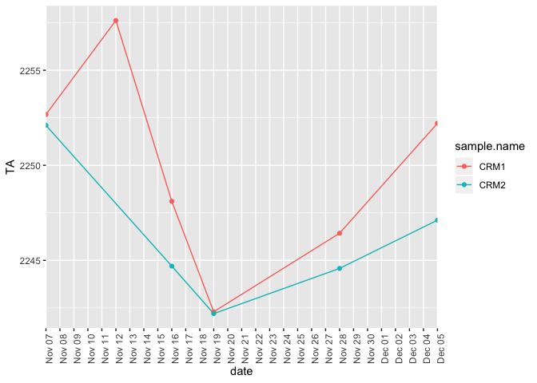
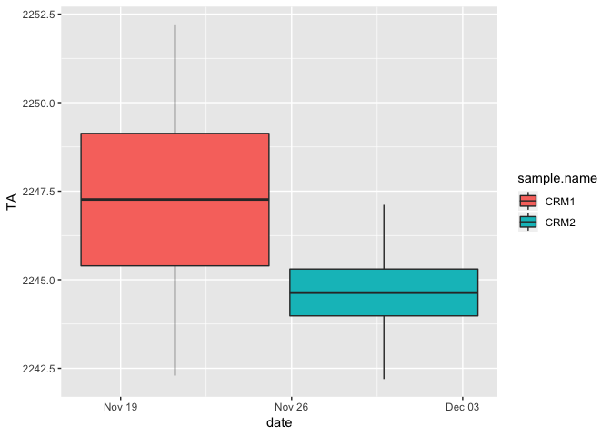

TitratorAnalysis
================
Shelly Trigg
12/18/2018

``` r
setwd("~/Documents/GitHub/P_generosa/Water_Chemistry/analysis/titrator/")

cumu.data <- read.csv("~/Documents/GitHub/P_generosa/Water_Chemistry/data/Titrator/Cumu_TA_Output.csv")
cumu.data$date <- as.POSIXct(substr(cumu.data$Sample.ID,0,8), format = "%Y%m%d")

fall.data <- cumu.data[which(cumu.data$date > as.POSIXct("2018-11-06", format = "%Y-%m-%d" )),]
fall.data$treatment <- "treatment"
for(i in 1:length(fall.data$treatment)){
  if(grepl("CRM",fall.data$sample.name[i])){
    fall.data$treatment[i] <- "STD"
  }
  if(grepl("JUNK", fall.data$sample.name[i], ignore.case = TRUE)){
    fall.data$treatment[i] <- "JUNK"
  }
  if(grepl("^3|^4", fall.data$sample.name[i])){
    fall.data$treatment[i] <- "ambient"
  }
  if(grepl("^1|^2", fall.data$sample.name[i])){
    fall.data$treatment[i] <- "low"
  }

}                              

#add column for tank
fall.data$tank <- substr(fall.data$sample.name,0,1)
```

TA over time for ambient and low treatments

    ## Warning: package 'ggplot2' was built under R version 3.4.4


Boxplots of all TA measurements (Nov 7-Nov 28) for ambient and low **WATER SAMPLES** 

Boxplots of all TA measurements (Nov 7-Nov 28) for ambient and low **TANKS** 

Is there a significant different between **TANKS** based on TA?

``` r
#test to see if treatments are sig. diff
summary(aov(TA ~ tank, data = fall.data[which(fall.data$Mass > 59 & fall.data$treatment == "ambient"| fall.data$treatment == "low"),]))
```

    ##             Df Sum Sq Mean Sq F value Pr(>F)
    ## tank         3    659   219.7   1.439  0.247
    ## Residuals   36   5495   152.7

``` r
TukeyHSD(aov(TA ~ tank, data = fall.data[which(fall.data$Mass > 59 & fall.data$treatment == "ambient"| fall.data$treatment == "low"),]))
```

    ##   Tukey multiple comparisons of means
    ##     95% family-wise confidence level
    ## 
    ## Fit: aov(formula = TA ~ tank, data = fall.data[which(fall.data$Mass > 59 & fall.data$treatment == "ambient" | fall.data$treatment == "low"), ])
    ## 
    ## $tank
    ##           diff       lwr       upr     p adj
    ## 2-1  0.5440692 -14.33712 15.425259 0.9996514
    ## 3-1 -8.1662721 -23.04746  6.714918 0.4609434
    ## 4-1 -7.4800844 -22.36127  7.401105 0.5357713
    ## 3-2 -8.7103414 -23.59153  6.170848 0.4044646
    ## 4-2 -8.0241537 -22.90534  6.857036 0.4761661
    ## 4-3  0.6861877 -14.19500 15.567377 0.9993022

At an adj. p \<= 0.05, there is **NOT** a significant difference between any other of the tanks, **BUT** there is more difference between DIFFERENT treatment tanks (1-3,1-4,2-3,2-4) than there is between SAME treatment tanks (1-2 and 3-4)

Boxplots of all TA measurements (Nov 7-Nov 28) for ambient and low TREATMENTS 

Is there a significant different between TREATMENTS based on TA?

``` r
#test to see if treatments are sig. diff
t.test(x= fall.data[which(fall.data$Mass > 59 & fall.data$treatment == "ambient"),"TA"], y =  fall.data[which(fall.data$Mass > 59 & fall.data$treatment == "low"),"TA"])
```

    ## 
    ##  Welch Two Sample t-test
    ## 
    ## data:  fall.data[which(fall.data$Mass > 59 & fall.data$treatment ==  and fall.data[which(fall.data$Mass > 59 & fall.data$treatment ==     "ambient"), "TA"] and     "low"), "TA"]
    ## t = -2.128, df = 26.9, p-value = 0.04265
    ## alternative hypothesis: true difference in means is not equal to 0
    ## 95 percent confidence interval:
    ##  -15.9021000  -0.2883258
    ## sample estimates:
    ## mean of x mean of y 
    ##  2102.318  2110.413

At p \<= 0.05, there **IS** a significant difference between TREATMENTS

Line plot of TA over time for CRMs 

boxplot of TA for CRMs from Nov 16-Dec 5 
