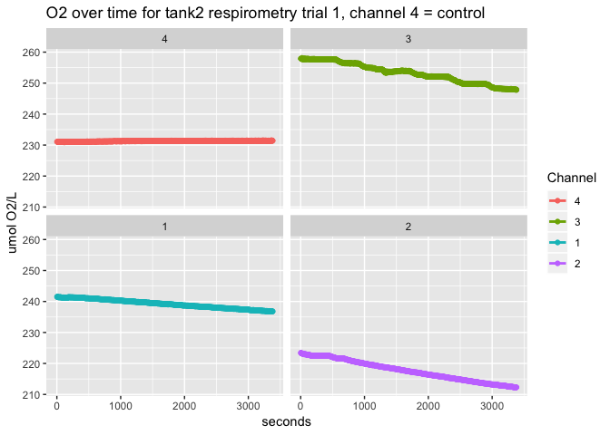
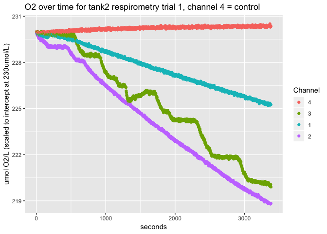
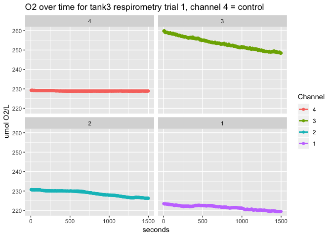
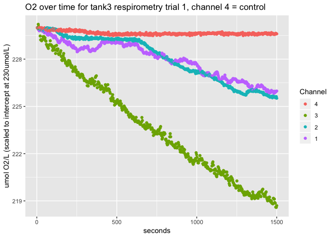
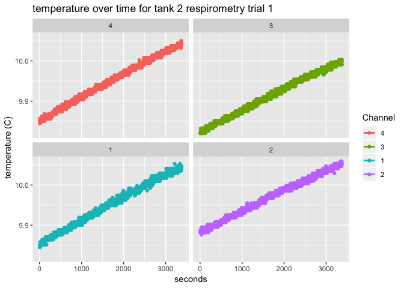
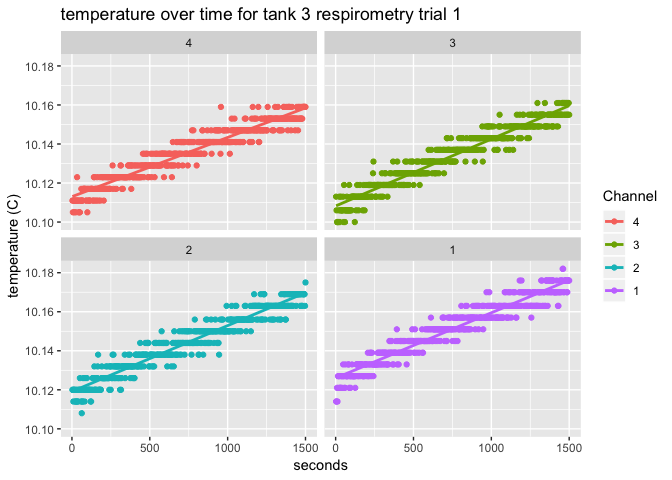
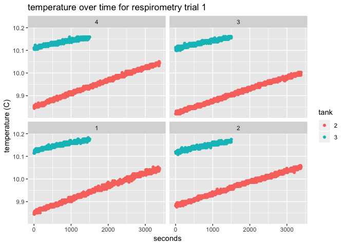
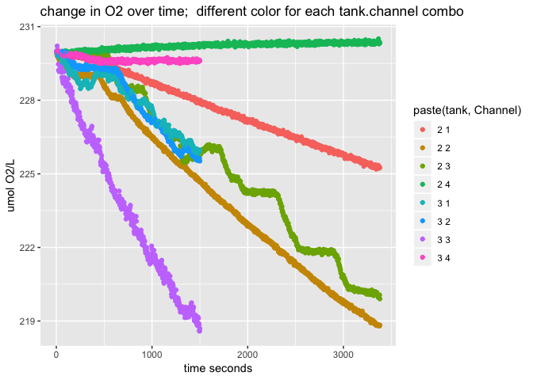
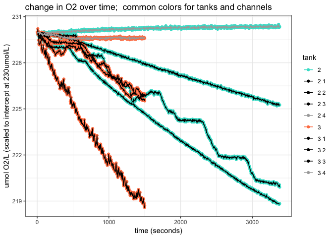
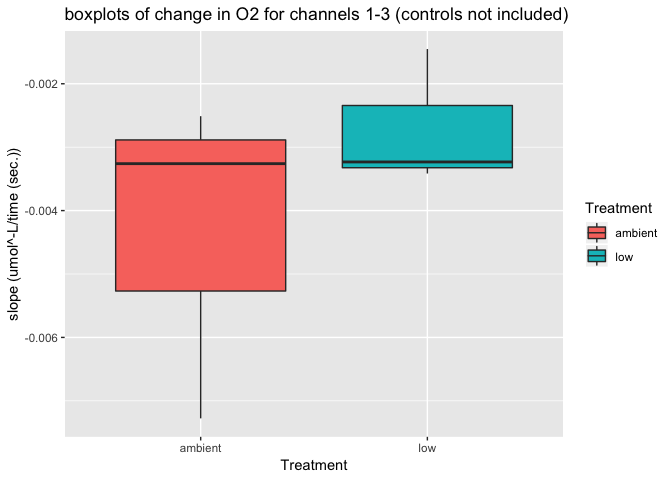

Fall 2018 Broodstock Respirometry Trial 1
================
Shelly Trigg
12/12/2018

This is a first pass at respirometry data analysis on the Dec. 3, 2018 trial on 3 animals from Tank 2 (constant low pH 6.8) and Tank 3 (ambient). The data has not yet been corrected with the blanks, the chamber size, or the biovolume.

Load libraries

    ## Warning: package 'ggplot2' was built under R version 3.4.4

    ## Warning: package 'tidyr' was built under R version 3.4.4

    ## Warning: package 'dplyr' was built under R version 3.4.4

    ## 
    ## Attaching package: 'dplyr'

    ## The following objects are masked from 'package:stats':
    ## 
    ##     filter, lag

    ## The following objects are masked from 'package:base':
    ## 
    ##     intersect, setdiff, setequal, union

    ## Warning: package 'kableExtra' was built under R version 3.4.4

plot O2 over time for Tank 2

plot O2 over time for Tank 3

Plot Temperature over time for tank 2 

Plot Temperature over time for tank 3 

Tank2 and Tank3 temperature data on the same plot 

Tank2 and Tank3 O2 data on the same plot 

Fitting lines and comparing slopes

|  Intercept (umol/L)|  slope (umol^-L/time (sec.))| Tank | Channel | Subject | Treatment |
|-------------------:|----------------------------:|:-----|:--------|:--------|:----------|
|            230.1187|                   -0.0014525| 2    | 1       | test    | low       |
|            229.9417|                   -0.0034153| 2    | 2       | test    | low       |
|            230.7827|                   -0.0032330| 2    | 3       | test    | low       |
|            230.0067|                    0.0001227| 2    | 4       | control | low       |
|            229.8767|                   -0.0025115| 3    | 1       | test    | ambient   |
|            230.4835|                   -0.0032600| 3    | 2       | test    | ambient   |
|            229.0767|                   -0.0072766| 3    | 3       | test    | ambient   |
|            229.7751|                   -0.0001576| 3    | 4       | control | ambient   |

