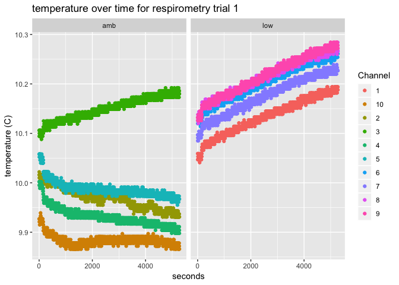
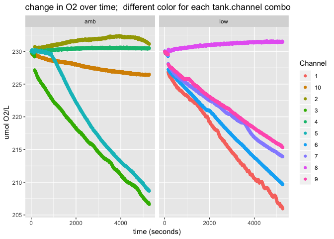
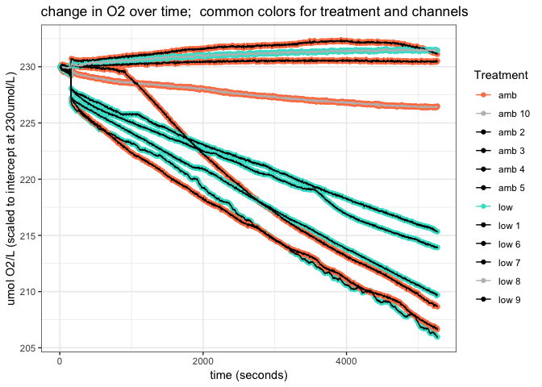
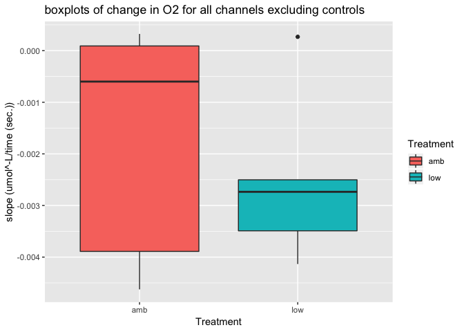

Fall 2018 Broodstock Respirometry Trial 2
================
Shelly Trigg
12/19/2018

This is a first pass at respirometry data analysis on the Dec. 12, 2018 trial on 4 animals from Tank 1 (constant low pH 6.8) and 4 animals from Tank 3 (ambient). The data has not yet been corrected with the blanks, the chamber size, or the biovolume.

Load libraries

    ## Warning: package 'ggplot2' was built under R version 3.4.4

    ## Warning: package 'tidyr' was built under R version 3.4.4

    ## Warning: package 'dplyr' was built under R version 3.4.4

    ## 
    ## Attaching package: 'dplyr'

    ## The following objects are masked from 'package:stats':
    ## 
    ##     filter, lag

    ## The following objects are masked from 'package:base':
    ## 
    ##     intersect, setdiff, setequal, union

    ## Warning: package 'kableExtra' was built under R version 3.4.4

Read in and merge metadata

Tank2 and Tank3 temperature data on the same plot 

Tank2 and Tank3 O2 data on the same plot 

| Channel |  Intercept (umol/L)|  slope (umol^-L/time (sec.))| Date     | Chamber | Animal  |  Tank| Treatment |  PVC.vol...mL.|  Animal.vol...mL.|
|:--------|-------------------:|----------------------------:|:---------|:--------|:--------|-----:|:----------|--------------:|-----------------:|
| 1       |            227.4596|                   -0.0041340| 12/12/18 | 1       | 6       |     1| low       |            200|              1100|
| 10      |            229.2336|                   -0.0005992| 12/12/18 | control | control |     3| amb       |             NA|                NA|
| 2       |            230.7061|                    0.0003241| 12/12/18 | 2       | 2       |     3| amb       |            250|              1500|
| 3       |            226.6686|                   -0.0038894| 12/12/18 | 3       | 3       |     3| amb       |            300|              1200|
| 4       |            230.1542|                    0.0000913| 12/12/18 | 4       | 14      |     3| amb       |            230|              1000|
| 5       |            231.9036|                   -0.0046252| 12/12/18 | 5       | 9       |     3| amb       |            180|              1000|
| 6       |            227.8078|                   -0.0034913| 12/12/18 | 6       | 11      |     1| low       |            150|              1180|
| 7       |            228.1096|                   -0.0027352| 12/12/18 | 7       | 2       |     1| low       |            250|              1125|
| 8       |            230.3108|                    0.0002683| 12/12/18 | 8       | control |     1| low       |             NA|                NA|
| 9       |            228.2971|                   -0.0025023| 12/12/18 | 9       | 14      |     1| low       |            175|               900|

